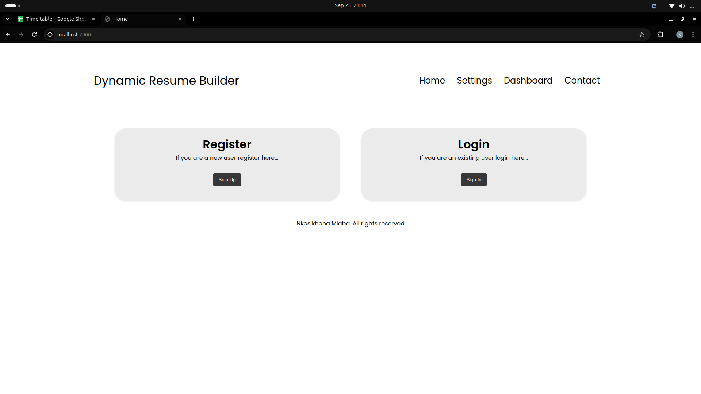
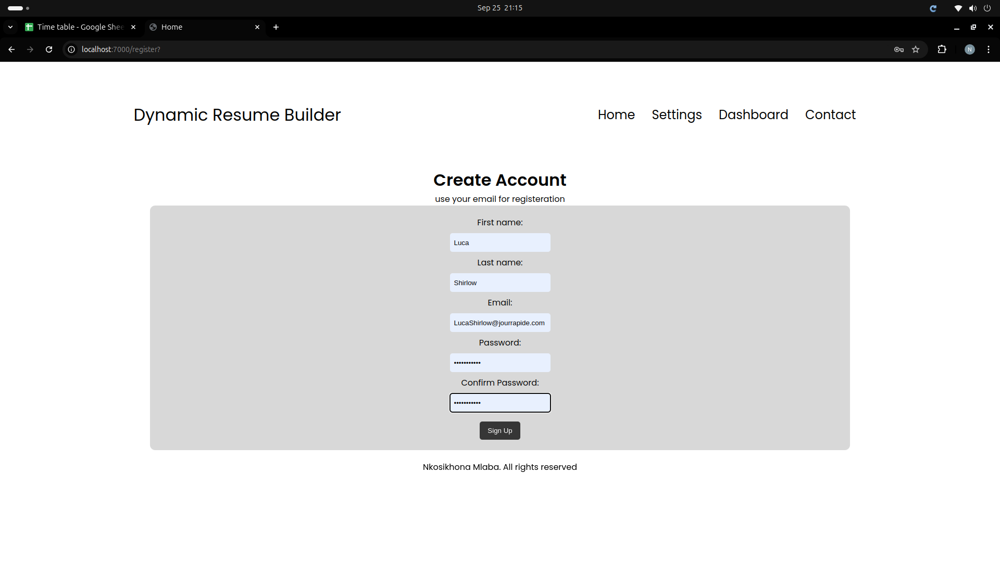
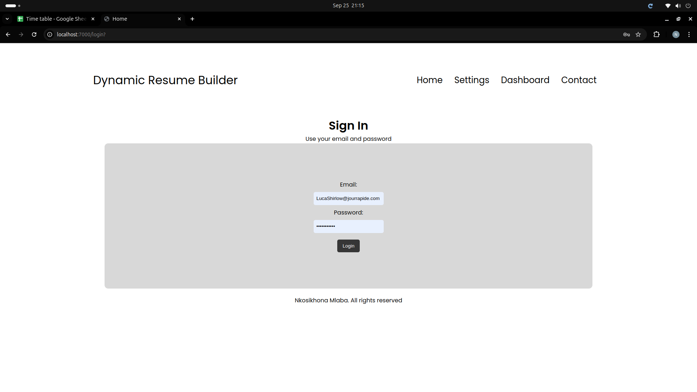
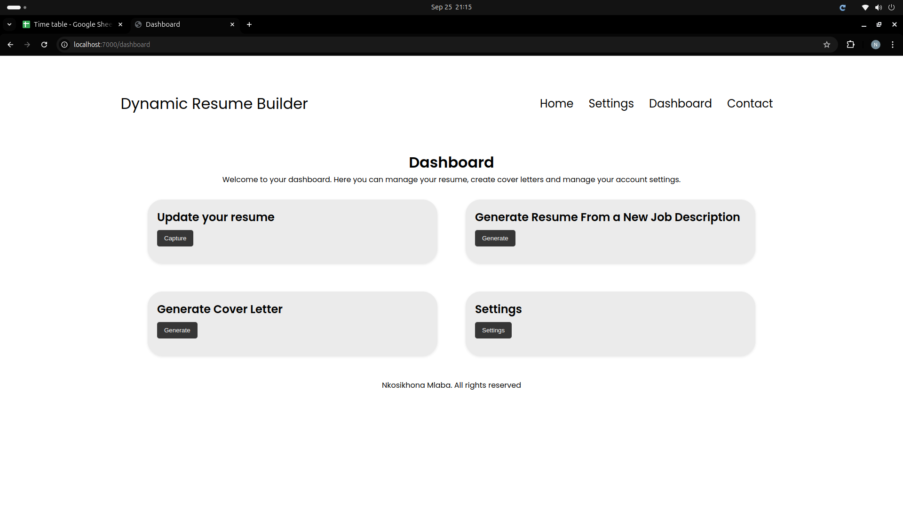
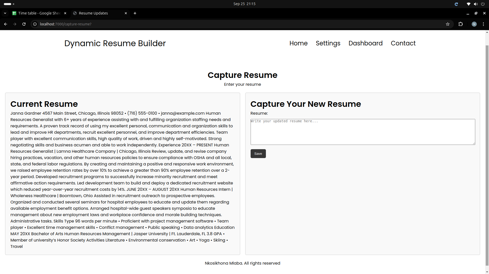
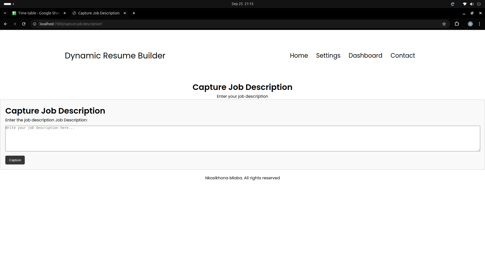
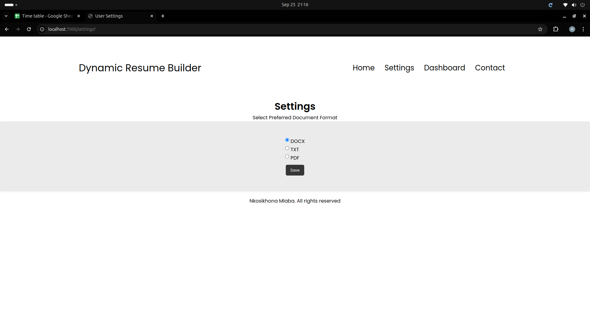
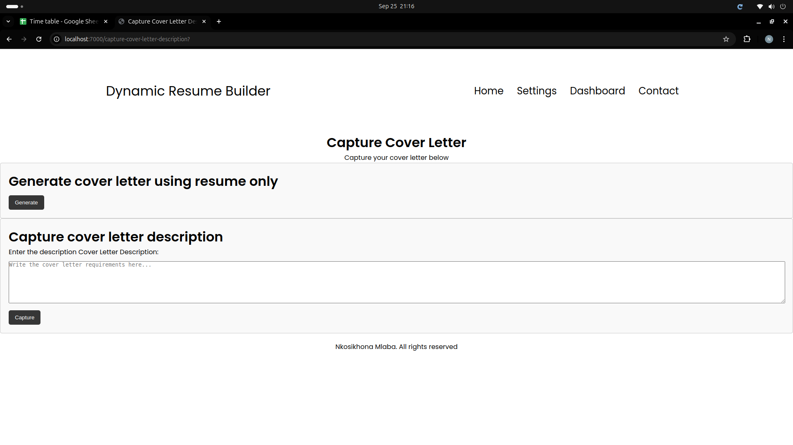
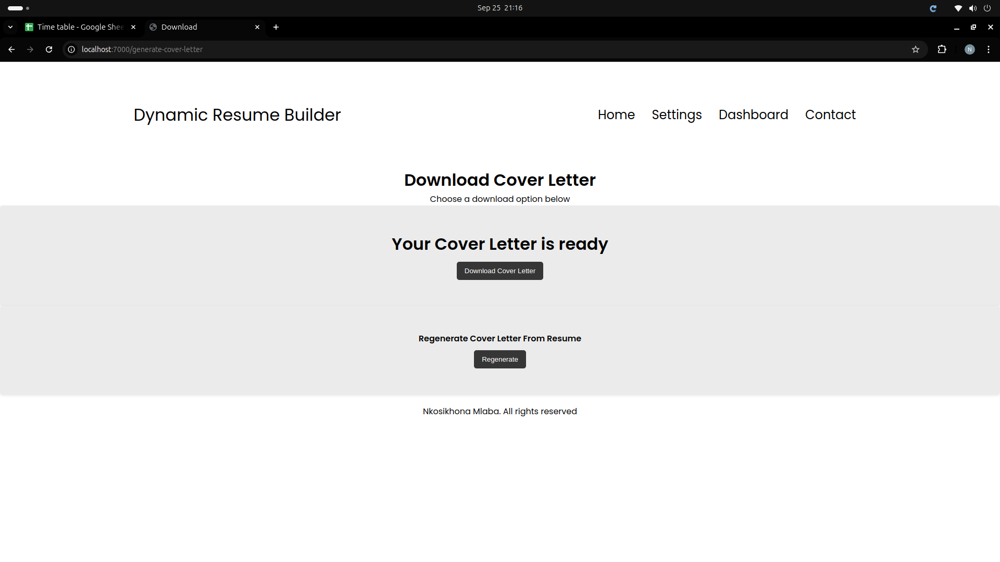

# Dynamic Resume Builder with AI

## Project Description:
This is a program designed to help job seekers create professional, optimised resumes that stand out to recruiters and pass through Applicant Tracking Systems (ATS).

## View live site [here](https://dynamic-resume-builder-with-ai.onrender.com/):

## Output ([gallery](program-output/Gallery.md))

|  |  |  |
|-------------------------------|-------------------------------|-------------------------------|
|  |  |  |
|  |  |  |

## Project Status 

Features implemented thus far are (not an exhaustive list):
- User registration and authentication
- Capturing and saving a user's current resume to a database
- Capturing a job description and generating an ATS friendly resume tailored to it
- Generating a cover letter using resume only
- Generating a cover letter tailored to a job description
- Changing resume and cover letter file formats
- Error handling:
    - Redirecting users to login page if they do not have valid session id

## System requirements:
- Java 11 or higher
- Internet browser
- SQLite
- Maven
- Make

## Additional requirements:
- Internet access
- Groq API key

## Compiling and testing:
1. Compile the project using: 
        
        make build
3. Run the tests using:
        
        make tests

## Running instructions:
1. Run the server using:
        
        make webapi
2. Run the frontend by visiting the url `http://localhost:7000/` on a browser

## Contributing

Contributions are welcome! If you find any issues or have suggestions for improvements, please open an issue or submit a pull request.

## Contributor

Nkosikhona Mlaba

## License

This project is licensed under the MIT License.